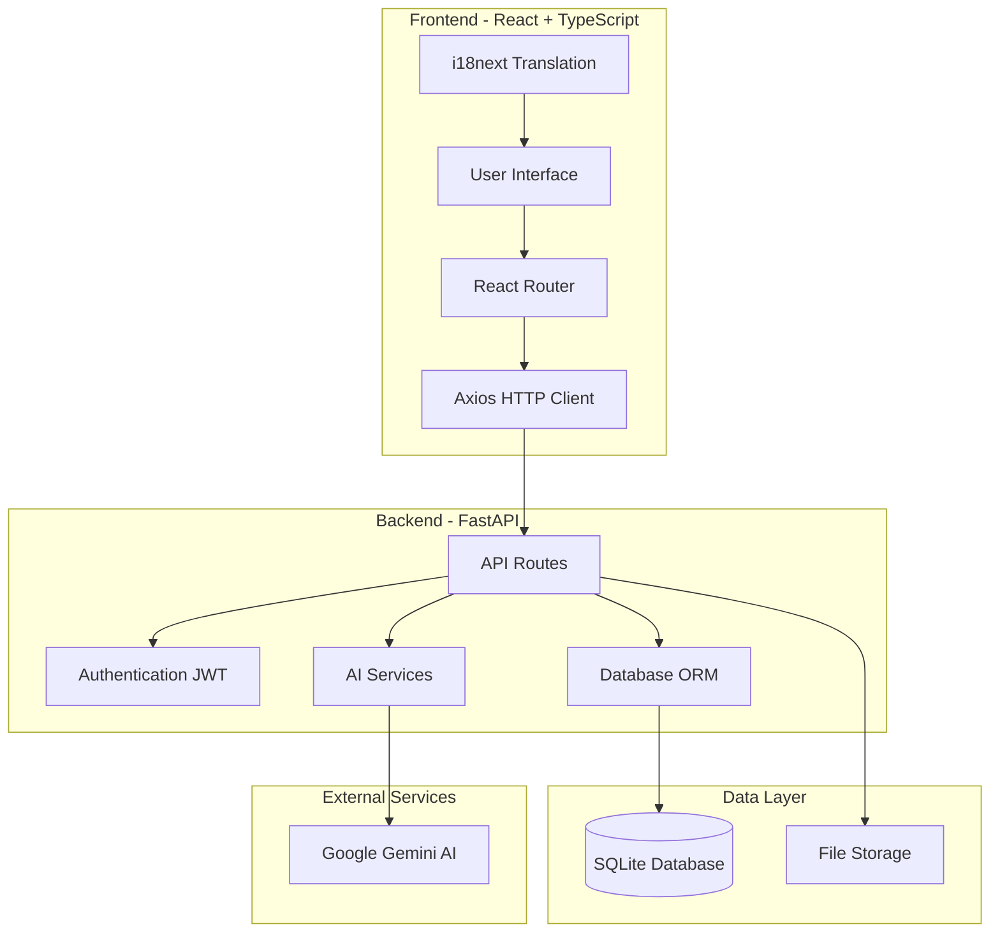
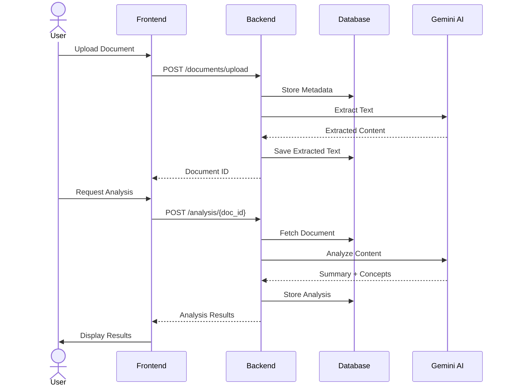
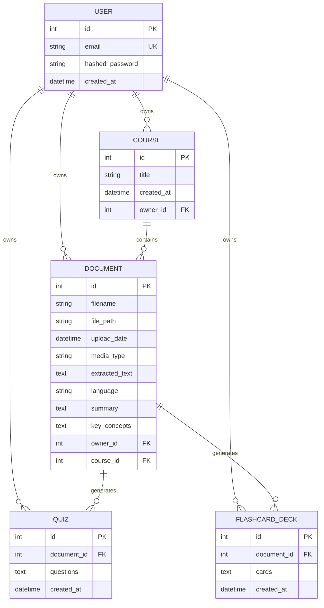

<div align="center">

<h1 style="font-family: 'Courier New', Courier, monospace; letter-spacing: 2px;">👩‍💻 LearnSync AI</h1>


A bilingual (Arabic/English) AI-powered educational platform that helps students organize study materials and generate summaries, quizzes, and flashcards using Google's Gemini AI.

</div>

## Table of Contents
- [Overview](#overview)
- [Key Features](#key-features)
- [Technical Architecture](#technical-architecture)
- [Technology Stack](#technology-stack)
- [Prerequisites](#prerequisites)
- [Installation & Setup](#installation--setup)
- [Running the Application](#running-the-application)
- [Project Structure](#project-structure)
- [API Documentation](#api-documentation)
- [Screenshots](#screenshots)
- [Contributing](#contributing)

## Overview

LearnSync AI is designed to transform how students manage and interact with their study materials. The platform leverages advanced AI capabilities to extract text from various file formats (PDFs, images, audio, video), generate intelligent summaries, identify key concepts, and create interactive study tools.

### Problem Statement
Students often struggle with:
- Organizing study materials across multiple courses
- Extracting meaningful information from diverse file formats
- Creating effective study aids (quizzes, flashcards)
- Supporting both Arabic and English content

### Solution
LearnSync AI provides:
- Course-based organization system
- AI-powered content extraction and analysis
- Automated generation of summaries, quizzes, and flashcards
- Full bilingual support (Arabic/English) with RTL layout

## Key Features

### 1. Multi-Format Document Processing
- **PDF**: Text extraction with OCR fallback for scanned documents
- **Images**: OCR for handwritten and printed text
- **Audio/Video**: Automatic transcription
- Language detection (Arabic/English)

### 2. AI-Powered Analysis
- **Intelligent Summarization**: Concise summaries of document content
- **Concept Extraction**: Automatic identification of key terms and definitions
- **Quiz Generation**: Multiple-choice questions based on content
- **Flashcard Creation**: Key term flashcards for memorization

### 3. Course Management
- Organize materials by course
- Track upload dates and document metadata
- Course-specific document filtering

### 4. Bilingual Support
- Full Arabic and English interface
- RTL (Right-to-Left) layout for Arabic
- Language-aware AI processing

## Technical Architecture



### System Flow



### Database Schema



## Technology Stack

### Frontend
- **Framework**: React 18 with TypeScript
- **Build Tool**: Vite
- **Routing**: React Router v6
- **HTTP Client**: Axios
- **Internationalization**: i18next
- **Styling**: CSS3 (Custom design system)
- **Icons**: Lucide React

### Backend
- **Framework**: FastAPI (Python 3.9+)
- **Database**: SQLite (with SQLAlchemy ORM)
- **Authentication**: JWT (python-jose)
- **Password Hashing**: bcrypt (passlib)
- **AI Integration**: Google Generative AI SDK
- **PDF Processing**: pypdf
- **Environment Management**: python-dotenv

### AI Services
- **Primary Model**: Google Gemini 2.0 Flash
- **Capabilities**: 
  - Text extraction (PDF, OCR)
  - Audio/Video transcription
  - Content summarization
  - Concept extraction
  - Quiz generation

## Prerequisites

Before installation, ensure you have:

- **Python**: Version 3.9 or higher
- **Node.js**: Version 16 or higher
- **npm**: Version 8 or higher
- **Google Gemini API Key**: [Get one here](https://makersuite.google.com/app/apikey)
- **Git**: For cloning the repository

## Installation & Setup

### 1. Clone the Repository

```bash
git clone https://github.com/yourusername/learnsync-ai.git
cd learnsync-ai
```

### 2. Backend Setup

```bash
# Navigate to backend directory
cd backend

# Create virtual environment
python -m venv venv

# Activate virtual environment
# On Windows:
.\venv\Scripts\activate
# On macOS/Linux:
source venv/bin/activate

# Install dependencies
pip install -r requirements.txt

# Create .env file from template
copy .env.example .env  # Windows
cp .env.example .env    # macOS/Linux

# Edit .env and add your Gemini API key
# GEMINI_API_KEY=your_actual_api_key_here
```

### 3. Initialize Database

```bash
# Still in backend directory with venv activated
python init_db.py
```

This creates the SQLite database with all required tables.

### 4. Frontend Setup

```bash
# Navigate to frontend directory (from project root)
cd frontend

# Install dependencies
npm install
```

## Running the Application

### Start Backend Server

```bash
# From backend directory with venv activated
python main.py
```

The backend API will start on `http://localhost:8000`

**API Documentation**: Visit `http://localhost:8000/docs` for interactive Swagger UI

### Start Frontend Development Server

```bash
# From frontend directory (in a new terminal)
npm run dev
```

The frontend will start on `http://localhost:5173`

### Access the Application

Open your browser and navigate to:
```
http://localhost:5173
```

## Project Structure

```
learnsync-ai/
├── backend/
│   ├── routers/
│   │   ├── auth.py           # Authentication endpoints
│   │   ├── courses.py        # Course management
│   │   ├── upload.py         # File upload handling
│   │   ├── analysis.py       # Document analysis
│   │   └── study_tools.py    # Quiz & flashcard generation
│   ├── services/
│   │   ├── ai_engine.py      # Gemini AI integration
│   │   ├── extraction.py     # Text extraction
│   │   ├── ocr.py           # Image OCR
│   │   └── transcription.py  # Audio/Video processing
│   ├── models.py             # Database models
│   ├── schemas.py            # Pydantic schemas
│   ├── database.py           # Database configuration
│   ├── security.py           # JWT & password handling
│   ├── main.py              # FastAPI application
│   ├── .env.example         # Environment template
│   ├── .gitignore           # Git exclusions
│   └── requirements.txt      # Python dependencies
├── frontend/
│   ├── src/
│   │   ├── components/
│   │   │   ├── Layout.tsx
│   │   │   ├── Navbar.tsx
│   │   │   ├── FileUpload.tsx
│   │   │   └── ui/          # Reusable UI components
│   │   ├── pages/
│   │   │   ├── Login.tsx
│   │   │   ├── Register.tsx
│   │   │   ├── Courses.tsx
│   │   │   ├── Dashboard.tsx
│   │   │   └── DocumentDetail.tsx
│   │   ├── i18n.ts          # Translation configuration
│   │   ├── App.tsx
│   │   └── main.tsx
│   ├── package.json
│   └── vite.config.ts
└── README.md
```

## API Documentation

### Authentication Endpoints

#### Register
```http
POST /auth/register
Content-Type: application/json

{
  "email": "user@example.com",
  "password": "securepassword"
}
```

#### Login
```http
POST /auth/token
Content-Type: application/x-www-form-urlencoded

username=user@example.com&password=securepassword
```

### Course Endpoints

#### Create Course
```http
POST /courses/
Authorization: Bearer {token}
Content-Type: application/json

{
  "title": "Data Mining Course"
}
```

#### List Courses
```http
GET /courses/
Authorization: Bearer {token}
```

### Document Endpoints

#### Upload Document
```http
POST /documents/upload
Authorization: Bearer {token}
Content-Type: multipart/form-data

file: [binary]
course_id: 1
```

#### Analyze Document
```http
POST /analysis/{document_id}
Authorization: Bearer {token}
```
# The User Interface

<div align="center">

### ✨Main Interface✨


Course organization dashboard

### ✨Document Upload✨


Multi-format file upload with progress indication

### ✨Document Analysis✨


AI-generated summary and key concepts

### ✨The Quiz and Flashcards✨


### ✨Quiz Generation✨


Interactive quiz based on document content

### ✨Flashcards✨


Study flashcards with term/definition pairs

### ✨Arabic Interface✨


Full RTL support for Arabic language

</div>

## Thanks For Reading, Raneem Sadeh🤍✨

---
